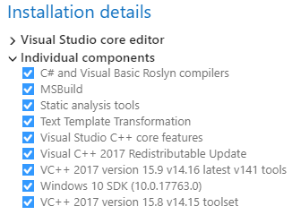

# SAR: Contributing Guide

## Building

Solution lives in the `SourceAutoRecord.sln` file and it has one project called `SourceAutoRecord`.
Project configurations lives in the `src/SourceAutoRecord.vcxproj` file.

### Windows

- Install Visual Studio 2017 and dependencies, for example:



- Rename paths to reflect the file tree of your own file system in `copy.bat`
- Open `SourceAutoRecord.sln` solution
- Choose either `Release` or `Debug` build
- Build the solution

### Linux

- g++ 5.4.0
- gcc-multilib
- g++-multilib
- Make 4.1
- Configure `makefile`

## Pull Requests

- Follow the coding style.
- Write a short description of what you added or what you changed.
- Prepend a PR title with `[WIP]` if it is a work in progress.

## Coding Style

Mostly follows [Webkit Style Guide](https://webkit.org/code-style-guidelines) with some exceptions:

- PascalCaseForClassesNamespacesStructsAndFunctions
- camelCaseForPropertiesAndVariables
- _LeadingUnderscoreForTypeAliases

A `.clang-format` file is included. I'd highly recommend using an extension:

- [ClangFormat](https://marketplace.visualstudio.com/items?itemName=LLVMExtensions.ClangFormat) for Visual Studio
- [Clang-Format](https://marketplace.visualstudio.com/items?itemName=xaver.clang-format) for Visual Studio Code

Note: You'll sometimes see a mix with Valve's coding style.

## Coding

SAR was designed to be able to load for multiple Source Engine games on Windows and Linux.

### Interfaces

Engine interfaces can easily be obtained and hooked:

```cpp
this->g_ClientDLL = Interface::Create(this->Name(), "VClient0");
```

SAR will resolve the interface version automatically. Use `VClient0` instead of `VClient001` etc.

Note: Modules implement `Module::Name` which returns their module name. For example: `client.so` for Linux and `client.dll` for Windows. There's also the `MODULE` macro that helps you with that.

### Offsets

An offset can be the number of bytes from one address to another, the index of a virtual function or the size of an object.

Where you need them:

- Finding pointers and static functions
- Accessing properties and pointers of objects:

```cpp
struct CEntInfo {
    void* m_pEntity; // 0
    int m_SerialNumber; // 4
    CEntInfo* m_pPrev; // 8
    CEntInfo* m_pNext; // 12
};
```

- Calling and hooking virtual functions:

```cpp
class IServerPluginCallbacks {
public:
    virtual bool Load(CreateInterfaceFn interfaceFactory, CreateInterfaceFn gameServerFactory) = 0; // 0
    virtual void Unload() = 0; // 1
    virtual void Pause() = 0; // 2
    virtual void UnPause() = 0; // 3
    ...
```

All offsets are declared in the `Offsets` namespace. If multiple variables have the same name rename them with a prefix. For example: `C_m_vecAbsOrigin` means client-side and `S_m_vecAbsOrigin` server-side.

Read [Game Support](#game-support) for initialization.

### Hooking

Functions will be hooked through virtual method tables (VMT). SAR provides useful macros for declaration:

```cpp
// Client.hpp
DECL_DETOUR(CreateMove, float flInputSampleTime, CUserCmd* cmd)

// Client.cpp
REDECL(Client::CreateMove);

// int __cdecl Client::CreateMove_Hook(void* thisptr, float flInputSampleTime, CUserCmd* cmd)
DETOUR(Client::CreateMove, float flInputSampleTime, CUserCmd* cmd)
{
    // Always call/return original function/value unless you know what you're doing
    return Client::CreateMove(thisptr, flInputSampleTime, cmd);
}

// Somewhere in Client::Init
this->g_ClientDLL->Hook(Client::HudUpdate_Hook, Client::HudUpdate, Offsets::HudUpdate);
```

Macros resolve the calling convention automatically: `__cdecl` for Linux and `__thiscall` as `__fastcall` with unused `edx` register for Windows. Use `DETOUR_T` for custom return types and `DETOUR_STD` for `__stdcall`.

### Memory Utils

#### Reading Pointer Paths

```cpp
// Address of original function
auto GetButtonBits = g_Input->Original(Offsets::GetButtonBits);

// Reads in_jump pointer from address + some offset
Memory::Deref(GetButtonBits + Offsets::in_jump, &this->in_jump);
```

#### Reading Function Addresses

```cpp
// Address of original function
auto JoyStickApplyMovement = g_Input->Original(Offsets::JoyStickApplyMovement);

// Reads function address from address + some offset
Memory::Read(JoyStickApplyMovement + Offsets::KeyDown, &this->KeyDown);
Memory::Read(JoyStickApplyMovement + Offsets::KeyUp, &this->KeyUp);
```

#### Others

```cpp
// External imports
auto tier0 = Memory::GetModuleHandleByName("libtier0.so");
auto Msg = Memory::GetSymbolAddress<_Msg>(tier0, "?ConColorMsg@@YAXABVColor@@PBDZZ");

Memory::CloseModuleHandle(tier0);

// Virtual function of an object
auto IsCommand = reinterpret_cast<bool (*)(void*)>(Memory::VMT(cmd, Offsets::IsCommand));
```

Only use these in experiments or tests:

```cpp
// Signature-Scanning aka AOB-Scan
auto address = Memory::Scan(MODULE("engine"), "55 8B EC 0F 57 C0 81 EC ? ? ? ", 178);

// Relative to absolute address
auto funcAddress = Memory::Absolute(MODULE("engine"), 0xdeadbeef);
```

### Console Commands

#### Variables

```cpp
// Boolean
Variable sar_simple_mode("sar_simple_mode", "0",
    "Useful help description.\n");
// Float
Variable sar_mode("sar_mode", "0", 0
    "Useful help description.\n");
// String
Variable sar_text("sar_text", "a string",
    "Useful help description.\n", 0);

// From the engine
auto sv_cheats = Variable("sv_cheats");
if (sv_cheats.GetBool()) {
    // Stop cheating
    sv_cheats.SetValue(0);
}
```

Note: Keep a static version of a variable if it can be accessed more than once.

#### Commands

```cpp
CON_COMMAND(sar_hello, "Useful help description.\n")
{
    if (args.ArgC() != 2) {
        return console->Print("Please enter a string!\n");
    }

    console->Print("Hello %s!\n", args[1]);
}
```

Note: Commands should always return a useful message if something went wrong.

### Game Support

Since offsets can be different for every engine or platform you have to define them in game classes. SAR only supports Portal 2 engine and Half-Life 2 engine (SteamPipe). Games that are based on these engines can easily derive offsets from them. Look into `Games` folder for examples.

#### Versions

```cpp
if (sar.game->version & SourceGame_Portal2) {
    // Only runs when game is Portal 2
}
```

#### Unique Console Commands

```cpp
// Only works in The Stanley Parable
sar_hello.UniqueFor(SourceGame_TheStanleyParable);
```

### SDK

A minimal Source Engine SDK can be found in `Utils/SDK.hpp`.

### Speedrun Timer

#### Rules

```cpp
#include "Features/Speedrun/TimerRule.hpp"

SAR_RULE3(moon_shot,        // Name of the rule
    "sp_a4_finale4",        // Name of the map
    "moon_portal_detector", // Name of the entity
    SearchMode::Names)      // Search in entity list by name
{
    // Access property
    auto portalCount = reinterpret_cast<int*>((uintptr_t)entity + 1337);

    if (*portalCount != 0) {
        return TimerAction::End; // Timer ends on this tick
    }

    return TimerAction::DoNothing; // Continue running
}
```

Note: Pointers of entities will be cached when the server has loaded. Make sure that the entity lives long enough to get any valid states. This also means that entities which get created at a later time cannot be accessed.

#### Categories

```cpp
#include "Features/Speedrun/TimerCategory.hpp"

SAR_CATEGORY(ApertureTag,                       // Name of game or mod
    RTA,                                        // Name of category
    _Rules({ &out_of_shower, &end_credits }));  // List of rules
```
